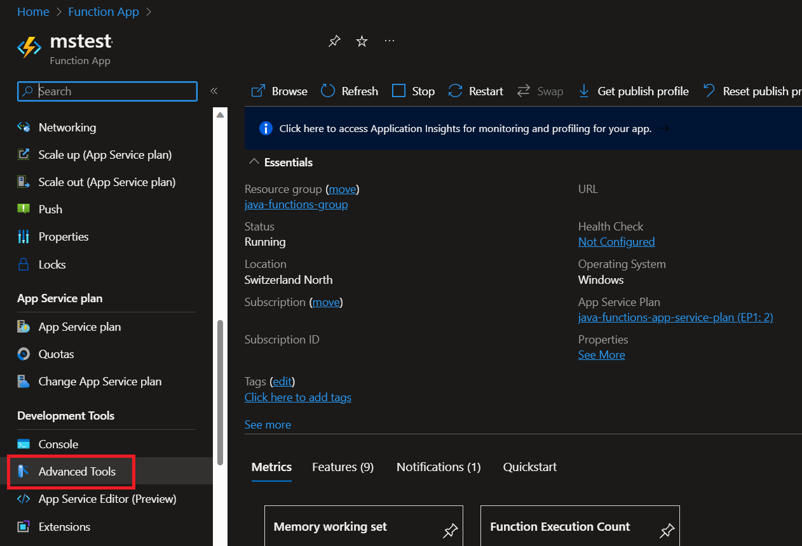

# How to Record Flight Recorder Data with Functions

## 1. Prepare your Load Test
A common tool to execute load test is Azure Load Test Service, it will help you to run multiple tests with various load patterns. You can configure your test runs and track your test results in the Azure portal. 


## 2. Start recording your Flight Recorder data



Next navigate to the Powershell console:


Find out the PID of the Java process that runs your function app:


Then trigger the recording by executing the following command:

```
jcmd 2172 JFR.start name=MyRecording settings=profile duration=30s filename="C:\home\jfr.jfr
```

(2172 is the PID and needs to be adopted based on the output of the previous command)

## 3. Download and Analyze the data.
Now you can download the file directly within Kudu:


And analyze it, for instance using VisualVM:
